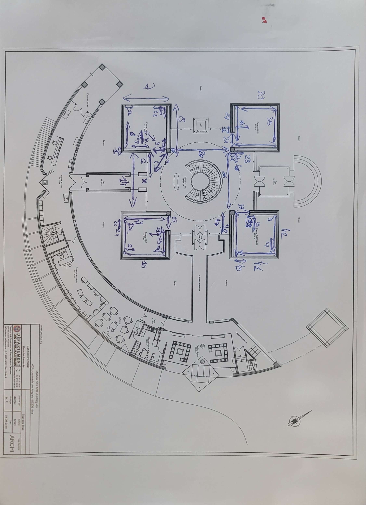

# Projet XR pour le Musée des Arts Asiatiques de Nice

## Description

Ce projet est une expérience de réalité étendue (XR) conçue pour le Musée des Arts Asiatiques de Nice. Il vise à enrichir l'expérience des visiteurs en leur permettant d'interagir avec les œuvres d'art de manière immersive.

## Fonctionnalités

- **Visite virtuelle** : Les utilisateurs peuvent se promener virtuellement dans le musée et voir les œuvres d'art sous différents angles.
- **Informations interactives** : En cliquant sur une œuvre d'art, les utilisateurs peuvent obtenir des informations détaillées sur celle-ci.
- **Réalité augmentée** : Les utilisateurs peuvent voir certaines œuvres d'art en réalité augmentée, ce qui leur permet de les explorer en détail.

## Installation

1. Clonez ce dépôt sur votre machine locale.
2. Installez Unreal Engine 4.26 avec l'option Hololens
3. Lancez l'application (Unreal Engine) puis commencez la simulation

## Utilisation

Après avoir lancé l'application, suivez les instructions à l'écran pour naviguer dans le musée et interagir avec les œuvres d'art.

## Contribution

Les contributions sont les bienvenues. Veuillez ouvrir une issue pour discuter de ce que vous aimeriez changer ou envoyer une pull request.

## Licence
N/A

## Fonctionnement du projet

Lorsque vous ouvrez le projet, vous allez directement arriver sur la map du musée. Les oeuvres sont disposés de manière a correspondre au mapping original du musée. 

Il est possible d'afficher une widget pour afficher des oeuvre d'arts et passant sa main gauche devant ses yeux et en la maintenant ainsi, avec la main droite appuyer sur le bouton "Spawn".

Il est aussi possible d'ouvrir un menu global, en appelant celui ci via reconnaissance vocale en disant simplement "Museum".
Dans celui ci différents outils sont disponibles.

Il est aussi possible d'ajouter ou de supprimer des anchors, ceux ci permettent de mapper la musée et de définir la localisation exacte des oeuvres.

Une IA a été ajoutée, celle ci fera la visite du musée. Il est possible de lui rajouter des étapes, en ajoutant au "MuseumPoint_BP" les points nécessaires.

Attention la mémoire de l'Hololens étant assez restreinte, il ne faut pas ajouter trop d'assets ou avoir un projet trop gros, sinon celui ci sera très compliqué à gérer.

# Guide de Démarrage Rapide pour Unreal Engine

Ce guide vous aidera à vous familiariser rapidement avec Unreal Engine (UE), l'un des moteurs de jeu les plus puissants et polyvalents disponibles aujourd'hui. Nous aborderons les concepts fondamentaux tels que Blueprint, GameMode, XR, ainsi que l'intelligence artificielle (IA) avec Behavior Trees (BTT), Blackboard (BB) et les Behaviour Trees (BT), des éléments essentiels pour créer des jeux interactifs et immersifs.

## Qu'est-ce qu'Unreal Engine ?

Unreal Engine est un moteur de jeu développé par Epic Games, utilisé pour créer des jeux vidéo, des simulations, des visualisations architecturales, et bien plus encore. Il offre des outils de développement avancés, une grande flexibilité et une qualité visuelle exceptionnelle.

## Blueprint (BP)

Blueprint est le système de scripting visuel d'Unreal Engine. Il permet aux développeurs de créer des logiques de jeu, des interactions et des comportements sans avoir à écrire de code traditionnel. Avec son interface intuitive de type glisser-déposer, Blueprint rend le développement de jeux plus accessible aux artistes et aux designers.

## GameMode (GM)

Le GameMode définit les règles de base et le comportement du jeu. Il contrôle des éléments tels que la façon dont les joueurs interagissent avec le monde, la gestion des scores, la détection des collisions, et bien plus encore. En modifiant le GameMode, vous pouvez personnaliser complètement l'expérience de jeu selon vos besoins spécifiques.

## Intelligence Artificielle (AI)

L'IA est essentielle pour créer des jeux interactifs et immersifs. Unreal Engine propose plusieurs outils pour implémenter des comportements d'IA complexes, notamment :

## Behaviour Trees (BT)

Les Behaviour Trees sont une technique de modélisation des comportements utilisée pour définir le comportement des entités dans un jeu. Ils offrent une approche visuelle et hiérarchique pour décrire les actions que les personnages peuvent effectuer et les conditions dans lesquelles ces actions doivent être déclenchées.

## Behavior Tree Tasks (BTT)

Les Behavior Tree Tasks sont des actions individuelles ou des tâches qui peuvent être exécutées par les entités contrôlées par l'IA dans un Behaviour Tree. Ils peuvent inclure des actions telles que se déplacer vers une position, attaquer un ennemi, ou effectuer une animation spécifique.

## Blackboard (BB)

Le Blackboard est une structure de données utilisée pour stocker des informations et des états pertinents pour les entités contrôlées par l'IA. Il permet aux Behavior Trees d'accéder et de mettre à jour ces informations en temps réel, ce qui facilite la prise de décision de l'IA.

## XR (Réalité Étendue)

Unreal Engine prend en charge la réalité étendue (XR), qui englobe la réalité virtuelle (VR), la réalité augmentée (AR) et d'autres formes d'expériences immersives. Avec les outils et les fonctionnalités intégrés d'Unreal Engine, vous pouvez créer des applications et des expériences XR de haute qualité pour une variété de plateformes, des casques VR aux appareils mobiles.

## Comment Commencer

Installation d'Unreal Engine : Téléchargez et installez Unreal Engine à partir du site officiel d'Epic Games.

Créez un Projet : Lancez l'Unreal Engine Editor et créez un nouveau projet en choisissant un modèle prédéfini ou en démarrant à partir de zéro.

Explorez l'Interface Utilisateur : Familiarisez-vous avec l'interface utilisateur de l'Unreal Engine Editor, y compris les vues de la scène, les panneaux d'outils, et les menus.

Apprenez les Bases de Blueprint : Explorez les tutoriels et la documentation sur Blueprint pour comprendre comment créer des logiques de jeu à l'aide de ce système de scripting visuel.

Expérimentez avec le GameMode : Modifiez le GameMode par défaut pour comprendre son impact sur le gameplay et apprenez à créer votre propre GameMode personnalisé.

Plongez dans XR : Si vous êtes intéressé par le développement VR ou AR, plongez dans la documentation spécifique à XR pour apprendre à créer des expériences immersives.

Ce guide constitue un point de départ pour explorer les fonctionnalités puissantes d'Unreal Engine. Continuez à apprendre, à expérimenter et à créer pour donner vie à vos idées de jeu !

# Quotations

1- 4.4M
2- 5M
3- 2.2M
4- 3.45M
5- 3.35M + 1.7M
6- 5.5M
7- 6.4M
8- 7.3M
9- 2.7M / Phénix
10- 2.3M / Disque Bi
11- 1.8M / Monstre gardien
12- 1.83M / Dame à Genoux
13- 3M / Cloche Bozhong
14- 9M
15- 2.3M
16- 7.2M
17- 6.5M
18- 6.5M
19- 4.2M
20- 2M / Déesse à l'arbre
21- 0.9M
22- 3M / Antropomorphe
23- 1.325M / Poignard
24- 1.322M / Pieds de trone
25- 1.631M
26- 9M
27- 2.3M
28- 7.15M
29- 6.4M
30- 6.45M
31- 0.8M
32- 1.64M / Verseuse
33- 0.86M
34- 2.82M / Samurai
35- Ito Kako
36- 9M
37- 2.27M
38- 0.836M
39- 2.7M / Tambour
40- 7.28M
41- 6.423M
42- 6.435M
43- Balustre
44- 2.266M / Chien Lion
45- 1.359M / Linto Sculpté
46 0.58M / Haniwa
47- Ossuaire
48- 3.6M Paire de daims

